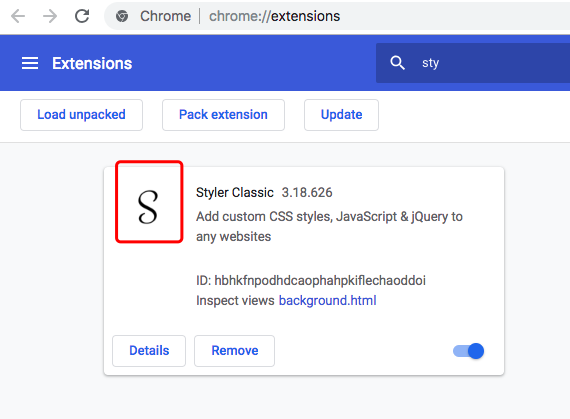

For too long we have to bear the ugly Gov's website.
This will make their website looks pretty. don't worry about the updated. I belive those website won't be updated in recent 100 years

## Step 1. Install Chrome extension 'Styler Classic'

## Step 2. paste the css or javascript code into it.

